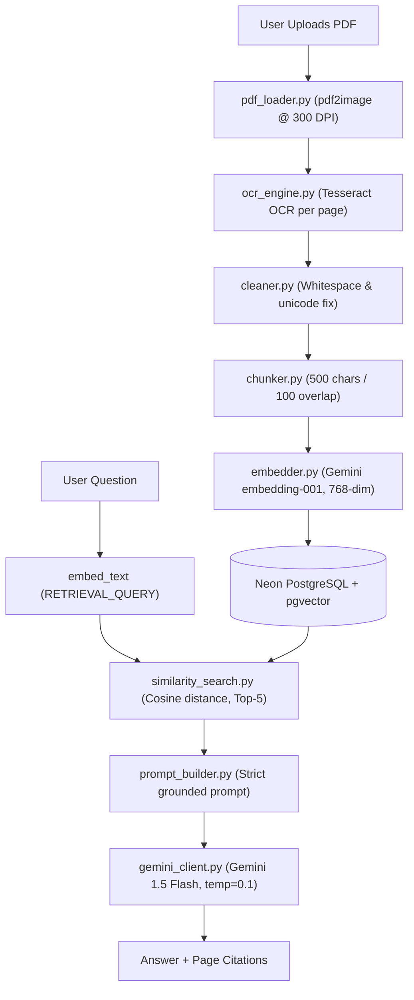

# ARCHITECTURE.md — Swiggy Annual Report RAG System

## System Overview



---

## Database Schema

```sql
CREATE TABLE document_chunks (
    id           SERIAL PRIMARY KEY,
    document_id  TEXT,
    page_number  INT,
    chunk_index  INT,
    content      TEXT,
    embedding    vector(768),
    created_at   TIMESTAMP DEFAULT NOW()
);
CREATE INDEX ON document_chunks USING ivfflat (embedding vector_cosine_ops)
WITH (lists = 100);
```

---

## Similarity Query

```sql
SELECT content, page_number, document_id,
       (embedding <=> %s::vector) AS score
FROM document_chunks
WHERE document_id = %s
ORDER BY embedding <=> %s::vector
LIMIT 5;
```

---

## Hallucination Mitigation

```
1. RETRIEVAL: Only chunks from the actual document
2. PROMPT:    "Answer ONLY using provided context"
3. REFUSAL:   "Say not available if absent"
4. CITATION:  "Always cite page numbers"
5. LLM TEMP:  0.1 (minimal variation)
6. TOP_P:     0.8 (focused sampling)
```

---

## Deployment

```bash
# Local
streamlit run app/main.py

# Docker
docker build -t swiggy-rag .
docker run -p 8501:8501 --env-file .env swiggy-rag
```
