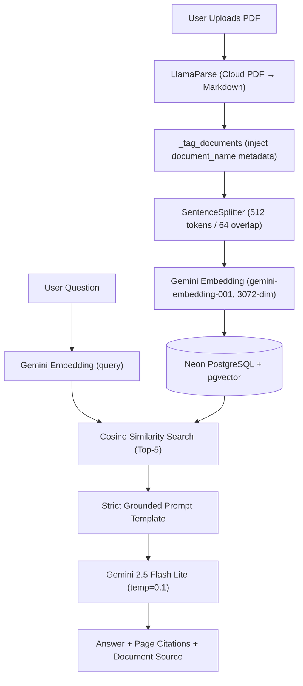

# ARCHITECTURE.md — Document RAG System (LlamaIndex Edition)

## System Overview



---

## Key Components

| Layer | Module | Responsibility |
|-------|--------|----------------|
| Config | `app/config.py` | Environment variables, URL helpers, file hashing, validation |
| LLM | `app/llm/__init__.py` | Centralized LlamaIndex Settings (GoogleGenAI LLM + GeminiEmbedding + SentenceSplitter) |
| Ingestion | `app/ingestion/pipeline.py` | LlamaParse → metadata tag → chunk → embed → upsert into Neon (with dedup) |
| Retrieval | `app/retrieval/query_engine.py` | Load index from Neon → QueryEngine with strict grounded prompt |
| UI | `app/main.py` | Streamlit chat interface with source citation and multi-document support |
| Logger | `app/utils/logger.py` | Structured logging utility |

---

## Multi-Document Support

All documents are stored in the **same** pgvector table (`document_chunks_llama`).
Each chunk carries a `document_name` field in its `metadata_` JSONB column, injected
during ingestion by `_tag_documents()`. This allows:

- Displaying which document a retrieved chunk came from
- The LLM prompt instructs the model to mention the source document when relevant
- Future: metadata filtering to scope retrieval to a single document

Duplicate uploads (same SHA-256 hash) are rejected with a `ValueError`.

---

## Database (auto-managed by LlamaIndex PGVectorStore)

The `llama-index-vector-stores-postgres` package creates and manages the
vector table automatically. No manual DDL required.

```
Table: document_chunks_llama
Columns: id, node_id, text, metadata_ (JSONB), embedding vector(3072)
Index:   HNSW / IVFFlat on embedding (cosine similarity)
```

`metadata_` stores: `page_label`, `document_name`, and other LlamaParse metadata.

Connection uses **both** sync (psycopg2) and async (asyncpg) drivers
so LlamaIndex can operate in either mode.

---

## Hallucination Mitigation

| # | Technique | Detail |
|---|-----------|--------|
| 1 | Retrieval scope | Only chunks from ingested documents |
| 2 | Strict prompt | "Answer ONLY using provided context" |
| 3 | Refusal | "Say not available if absent" |
| 4 | Citation | "Always cite page numbers" |
| 5 | Low temperature | `0.1` |
| 6 | Table fidelity | LlamaParse preserves Markdown tables — exact numbers used |
| 7 | Document source | Prompt instructs model to mention document_name when relevant |

---

## Deployment

```bash
# Local
streamlit run app/main.py

# Docker
docker build -t doc-rag .
docker run -p 8501:8501 --env-file .env doc-rag
```
